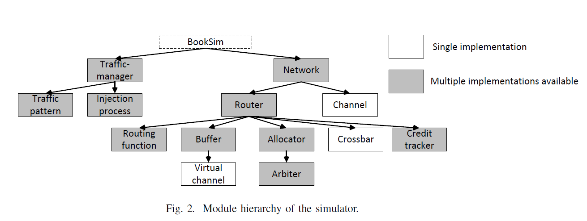

# reconf_route
## booksimの改造
- simulatorのモジュール階層

- パケットのinject/eject

- 方針
  - R_old, R_int, R_newを用意
  - t = T_reconf (再構成の開始時刻) より前にinjectされたパケットを監視
  - t = T_reconf で新しいパケットをR_intに移行。
    - 全ての古いパケットがejectされたらR_newに移行。

- 必要な改造
  - (パケットの監視)
  - global.hpp, main.cpp
    - 古いパケットのeject完了を示す変数Rold_ejectedをグローバルに用意
    - T_reconfをグローバルに用意
  - booksim_config.cpp
    - T_reconfを受け取れるようにする
    - 参考：
      - booksim_config.cpp:241:  _int_map["use_trace_file"] = 0;
        globals.hpp:72:extern bool _use_trace_file;
        main.cpp:138:bool _use_trace_file = false;
        main.cpp:300:  _use_trace_file = (config.GetInt("use_trace_file")==1);
  - trafficmanager.cpp
    - 古いパケットの監視
    - Rold_ejectedの更新
      - _StepでRold_ejectedの更新チェック
        - T_reconf以降、Rold_ejected=falseで_in_flight_Rold長さ0ならall ejected
  -
  - テストベッド
    - XY routing, WF, EFのテーブルを作るスクリプト (for cncnet_reconf)
  - 
  - (3種類のルーティング)
  - routefunc.{cpp,hpp}に
    - global_routing_tableを3つ (R_old, R_int, R_new) を用意
  - cncnet_reconf.{cpp,hpp}
    - global_routing_tableを3つ用意
    - ファイル読込、テーブル生成
  - (ルーティングの切り替え)
    - flitのinjection timeとRold_ejectedの状態で引くテーブルを変える

- ToDo
  - UD routingを吐き出すスクリプト
  - 実装
    - 移動平均の可視化
    - all ejectedからR_newへのスイッチングにインターバル持たせる
  - NPBトレース評価

- 
- 実装方針
  - small stepで
  - 新しい結果をこまめに可視化する
